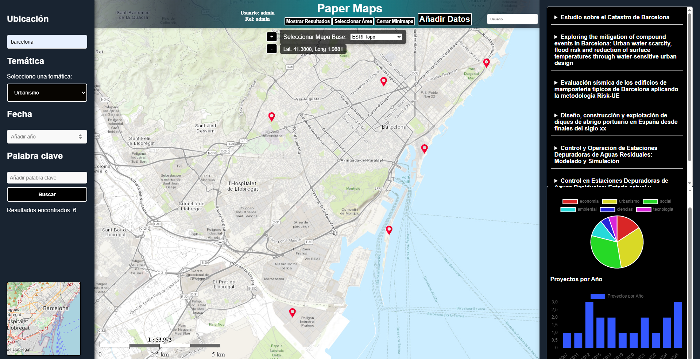
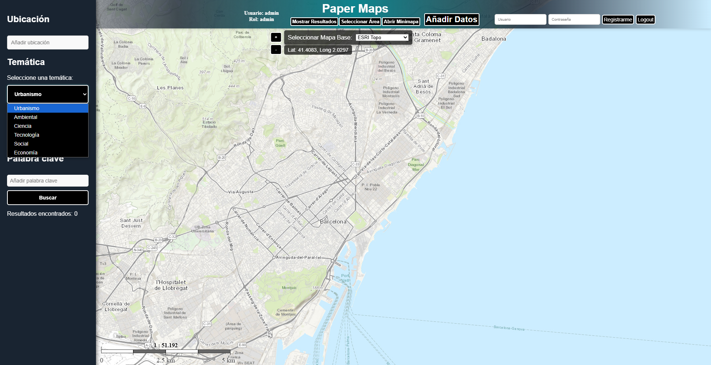
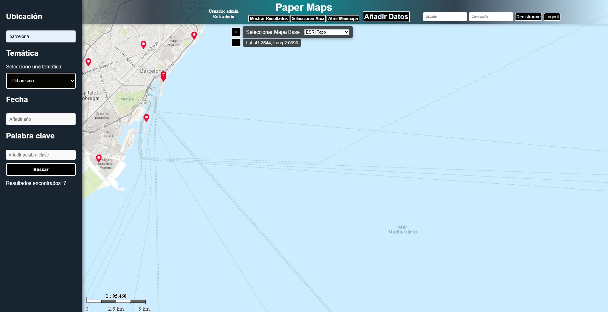
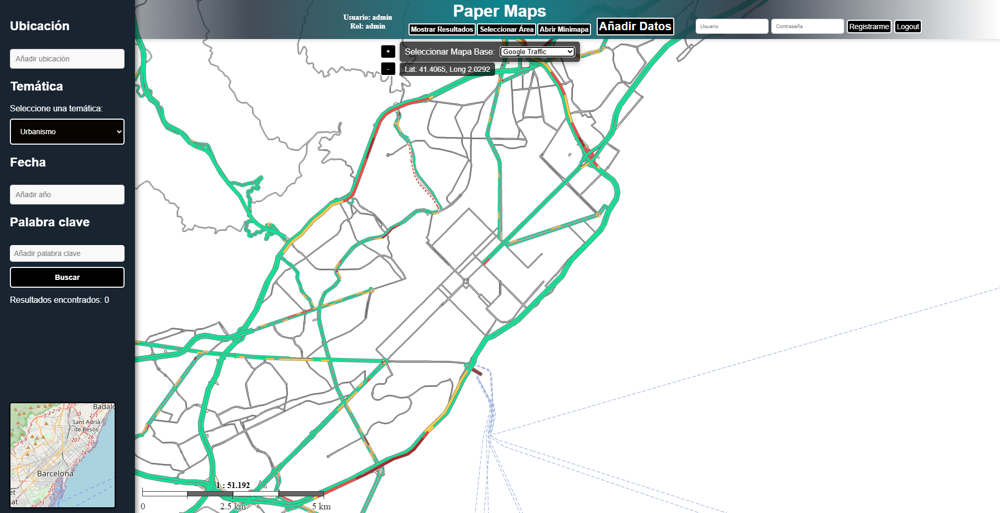
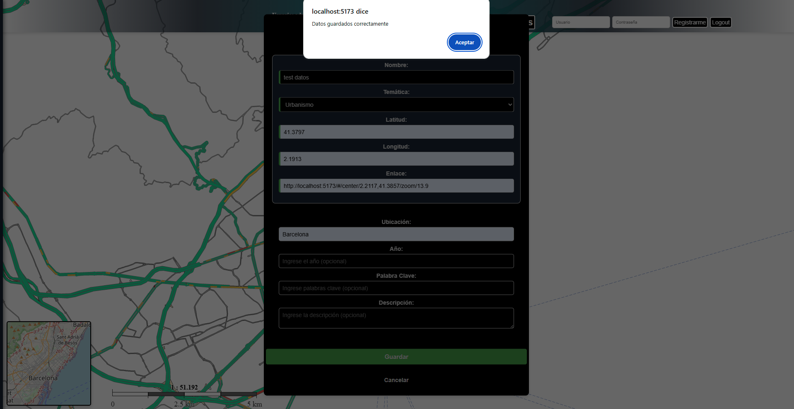

# Paper Maps — WebGIS
Aplicació WebGIS desenvolupada per a la visualització,
consulta i gestió d'informació geogràfica.

  JavaScript · OpenLayers · PostgreSQL · PostGIS · QGIS

  

 <strong>Interactive WebGIS application for the visualization, query and management of geospatial information.</strong> 

 JavaScript · OpenLayers · PostgreSQL · PostGIS · QGIS 

Overview

Paper Maps is an interactive WebGIS application developed for the visualization, consultation and management of geospatial information.

The application combines a web-based mapping interface with spatial databases to provide an interactive environment for exploring and managing geographic data.

Key Features
Interactive visualization of geographic data
Location-based information search
Thematic filtering
Geolocated query results
Visualization of multiple geographic layers
Incorporation and management of new spatial records
Application
Interactive Map

The main interface provides an interactive map for exploring the available geographic information.

  

Thematic Filtering

Users can select different thematic categories to filter the information displayed on the map.

  

Search & Results

Geographic information can be queried using different search criteria, with the results displayed directly on the map.

  

Geographic Data Visualization

The application supports the visualization of different types of spatial information and geographic layers.

  

Data Management

New records can be incorporated into the system and associated with geographic locations.

  

Technologies
Category	Technologies
Frontend	JavaScript, HTML, CSS
Web Mapping	OpenLayers
Spatial Database	PostgreSQL, PostGIS
GIS	QGIS
Project Structure
Paper-Maps/
├── images/
├── src/
├── data/
├── ...
└── README.md
Purpose

The project demonstrates the development of a WebGIS workflow integrating web mapping, spatial databases and desktop GIS technologies into a single geospatial application.

Aplicació WebGIS desenvolupada per a la visualització,
consulta i gestió d'informació geogràfica.

## Objectiu

El projecte té com a objectiu desenvolupar una aplicació
WebGIS interactiva que permeti visualitzar, consultar,
filtrar i gestionar informació geolocalitzada.

## Funcionalitats

- Visualització interactiva de dades geogràfiques.
- Cerca d'informació per ubicació.
- Filtrat temàtic de dades.
- Visualització de resultats geolocalitzats.
- Gestió i incorporació de noves dades.
- Visualització de diferents capes geogràfiques.

## Tecnologies

- JavaScript
- HTML
- CSS
- OpenLayers
- PostgreSQL
- PostGIS
- QGIS

## Captures de l'aplicació

### Vista general

### Filtrat temàtic

L'aplicació permet seleccionar diferents categories
temàtiques per filtrar la informació visualitzada.

### Cerca i resultats

La informació es pot consultar mitjançant diferents
criteris de cerca, mostrant els resultats sobre el mapa.

### Visualització de dades geogràfiques

L'aplicació permet representar diferents tipus
d'informació espacial sobre el mapa.

### Incorporació de dades

El sistema permet incorporar nous registres associats
a una ubicació geogràfica.

